# 🚨 Disaster Response Coordination Platform

<div align="center">


**A comprehensive real-time disaster management system for coordinating emergency relief efforts**

[](https://disaster-response-coordination-plat-flame.vercel.app/)
[](https://github.com/banti8974/Disaster-Response-Platform_Assi)


</div>

---

## 🌟 Overview

The **Disaster Response Coordination Platform** is a full-stack MERN application designed to streamline emergency response operations. Built with modern technologies and AI-powered features, it provides real-time coordination tools for disaster management teams, relief organizations, and emergency responders.

### 🎯 **Live Application**
**🔗 [disaster-response-coordination-plat-flame.vercel.app](https://disaster-response-coordination-plat-flame.vercel.app/)**

---

## ✨ Key Features

### 🚨 **Core Disaster Management**
- **Real-time Dashboard** - Live monitoring of active disasters and resources
- **CRUD Operations** - Complete disaster lifecycle management
- **Audit Trails** - Comprehensive tracking of all actions and changes
- **Role-based Access** - Secure authentication with admin/contributor roles

### 🤖 **AI-Powered Intelligence**
- **Smart Location Extraction** - Google Gemini AI automatically extracts locations from descriptions
- **Intelligent Geocoding** - Converts location names to precise coordinates
- **Image Verification** - AI-powered authenticity checking for disaster images
- **Priority Classification** - Automatic urgency detection in social media posts

### 📱 **Real-time Communication**
- **Live Social Media Monitoring** - Aggregates disaster-related posts and alerts
- **Official Updates Feed** - Government and relief organization announcements
- **WebSocket Integration** - Instant updates across all connected clients
- **Priority Alerts** - Real-time notifications for urgent situations

### 🗺️ **Geospatial Capabilities**
- **Interactive Maps** - Visual representation of disasters and resources
- **Proximity Queries** - Find nearby shelters, supplies, and emergency services
- **PostGIS Integration** - Advanced geospatial database operations
- **Resource Mapping** - Real-time tracking of emergency resources

### 🎨 **Modern User Experience**
- **Responsive Design** - Optimized for desktop, tablet, and mobile
- **Dark/Light Themes** - User preference support
- **Smooth Animations** - Framer Motion powered interactions
- **Accessibility First** - WCAG compliant design principles

---

## 🛠 Technology Stack

<div align="center">

### **Frontend**


### **Backend**


### **Database & Services**


</div>

---

## 🚀 Live Demo Features

Visit **[the live platform](https://disaster-response-coordination-plat-flame.vercel.app/)** to explore:

### 📊 **Dashboard**
- Real-time disaster statistics and metrics
- Recent activity feed with live updates
- Quick action buttons for emergency reporting
- System health and connection status

### 📱 **Social Media Monitoring**
- Navigate to `/social-media` to see live social media aggregation
- Filter posts by priority (Urgent, High, Medium, Low)
- Search functionality with keyword and hashtag support
- Real-time feed updates with priority-based sorting

### 🏛️ **Official Updates**
- Access `/browse` for government and relief organization updates
- Multi-source aggregation (FEMA, Red Cross, NYC Emergency, Weather Service)
- Category-based filtering (Shelter, Supplies, Weather, Volunteer)
- Advanced search across all official sources

### 🗺️ **Interactive Features**
- Create and manage disaster reports
- Real-time geospatial resource mapping
- AI-powered location extraction from descriptions
- Live WebSocket updates across all connected users

---

## 🏗️ Architecture

```mermaid
graph TB
    A[Frontend - React] --> B[Backend - Express.js]
    B --> C[Database - Supabase]
    B --> D[Google Gemini AI]
    B --> E[Maps APIs]
    B --> F[Social Media APIs]
    A <--> G[WebSocket - Real-time]
    C --> H[PostGIS - Geospatial]
    B --> I[Cache Layer]
    
    style A fill:#61DAFB
    style B fill:#339933
    style C fill:#3ECF8E
    style D fill:#4285F4
    style G fill:#010101
```



---

## 📱 User Interface Highlights

### 🎨 **Modern Design System**
- **Clean Interface** - Minimalist design focused on usability during emergencies
- **Color-Coded Priorities** - Visual hierarchy for urgent vs. normal information
- **Responsive Grid** - Optimized layouts for all screen sizes
- **Loading States** - Smooth transitions and loading indicators

### 🔔 **Real-time Notifications**
- **Toast Notifications** - Non-intrusive alerts for important updates
- **Priority Badges** - Visual indicators for urgency levels
- **Live Counters** - Real-time statistics and metrics
- **Status Indicators** - Connection and system health monitoring

---

## 🔧 Technical Implementation

### **Smart Caching System**
```javascript
// Intelligent caching with TTL
const cacheKey = `social_media_${disasterId}_${keywords}`;
const cachedData = await getCachedData(cacheKey);
if (cachedData) return cachedData;
```

### **Real-time WebSocket Events**
```javascript
// Live disaster updates
socket.on('disaster_updated', (data) => {
  updateDisasterList(data);
  showNotification('Disaster Updated', data.title);
});
```

### **AI-Powered Location Extraction**
```javascript
// Google Gemini integration
const location = await extractLocationFromText(description);
const coordinates = await geocodeLocation(location);
```

### **Geospatial Queries**
```sql
-- Find resources within 10km radius
SELECT * FROM resources 
WHERE ST_DWithin(location, ST_Point($1, $2)::geography, 10000);
```

---

## 🎯 Key Achievements

### ⚡ **Performance**
- **Sub-second load times** with optimized caching
- **Real-time updates** with <100ms latency
- **Efficient database queries** with geospatial indexing
- **Responsive design** supporting all devices

### 🔒 **Security & Reliability**
- **Rate limiting** to prevent API abuse
- **CORS protection** for secure cross-origin requests
- **Error handling** with graceful degradation
- **Audit trails** for complete action tracking

### 🌐 **Scalability**
- **Microservice architecture** for horizontal scaling
- **Database indexing** for query optimization
- **CDN integration** for global content delivery
- **Load balancing** ready infrastructure

---

## 🔗 Quick Links

<div align="center">

| Resource | Link |
|----------|------|
| 🌐 **Live Application** | [disaster-response-coordination-plat-flame.vercel.app](https://disaster-response-coordination-plat-flame.vercel.app/) |
| 📁 **Source Code** | [github.com/banti8974/Disaster-Response-Platform_Assi](https://github.com/banti8974/Disaster-Response-Platform_Assi) |
| 📊 **Social Media Feed** | [/social-media](https://disaster-response-coordination-plat-flame.vercel.app/social-media) |
| 🏛️ **Official Updates** | [/browse](https://disaster-response-coordination-plat-flame.vercel.app/browse) |
| 🗺️ **Resource Map** | [/map](https://disaster-response-coordination-plat-flame.vercel.app/map) |

</div>

---

## 🚦 Getting Started

### **Prerequisites**
- Node.js 18+
- npm or yarn
- Supabase account
- Google Cloud Platform account

### **Quick Setup**
```bash
# Clone the repository
git clone https://github.com/banti8974/Disaster-Response-Platform_Assi.git
cd Disaster-Response-Platform_Assi

# Install backend dependencies
cd backend
npm install
cp .env.example .env
# Configure your environment variables
npm run dev

# Install frontend dependencies (new terminal)
cd frontend
npm install
cp .env.example .env
# Configure your environment variables
npm start
```

### **Environment Variables**
```env
# Backend (.env)
SUPABASE_URL=your_supabase_url
SUPABASE_ANON_KEY=your_supabase_key
GEMINI_API_KEY=your_gemini_key
GOOGLE_MAPS_API_KEY=your_maps_key

# Frontend (.env)
REACT_APP_API_URL=http://localhost:5001/api
REACT_APP_WEBSOCKET_URL=http://localhost:5001
```

---

## 📈 Future Enhancements

### 🔮 **Planned Features**
- **Mobile Apps** - Native iOS and Android applications
- **Offline Support** - PWA capabilities for offline usage
- **ML Predictions** - Predictive analytics for disaster patterns
- **Multi-language** - Internationalization support
- **Advanced Analytics** - Comprehensive reporting dashboard

### 🤝 **Community Features**
- **Volunteer Management** - Coordination tools for volunteers
- **Resource Donations** - Platform for resource coordination
- **Training Modules** - Emergency response training
- **Public APIs** - Open APIs for third-party integration

---

## 🤝 Contributing

We welcome contributions! Please see our [Contributing Guide](CONTRIBUTING.md) for details.

### **Development Process**
1. Fork the repository
2. Create a feature branch (`git checkout -b feature/amazing-feature`)
3. Commit your changes (`git commit -m 'Add amazing feature'`)
4. Push to the branch (`git push origin feature/amazing-feature`)
5. Open a Pull Request

---

## 📄 License

This project is licensed under the MIT License - see the [LICENSE](LICENSE) file for details.

---

## 🙏 Acknowledgments

- **Emergency Response Teams** worldwide for inspiration
- **Open Source Community** for amazing tools and libraries
- **Google** for Gemini AI and Maps APIs
- **Supabase** for incredible backend-as-a-service platform
- **Vercel** for seamless deployment and hosting

---

<div align="center">

**🚨 Built for Emergency Responders, by Developers Who Care 🚨**

[](https://github.com/banti8974/Disaster-Response-Platform_Assi/stargazers)
[](https://github.com/banti8974/Disaster-Response-Platform_Assi/network/members)

**⭐ Star this repository if it helped you! ⭐**

[Report Bug](https://github.com/banti8974/Disaster-Response-Platform_Assi/issues) · [Request Feature](https://github.com/banti8974/Disaster-Response-Platform_Assi/issues) · [Contribute](CONTRIBUTING.md)

</div>
